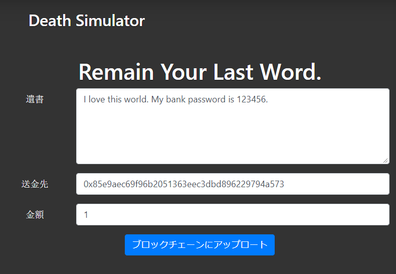
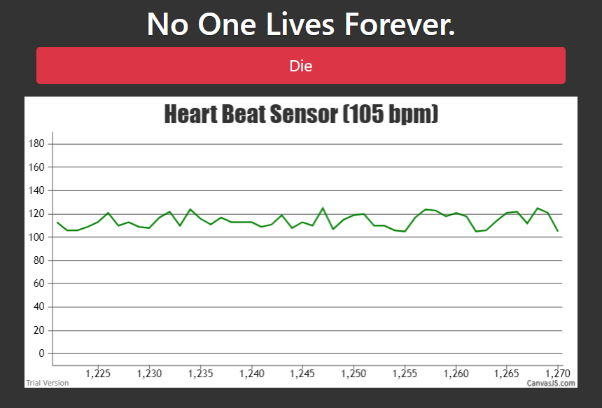
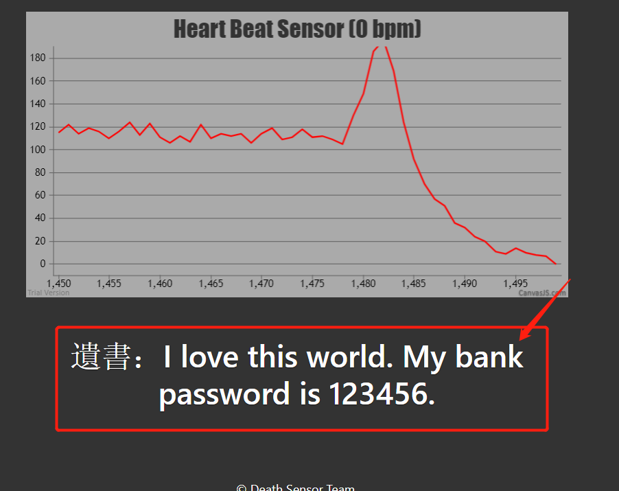

# Introduction

This is a demo application for OPERA Hackson @ Hakone, 15th - 16th Aug 2018.

We consider the block chain can be used for heritage because it can not be falsified.
The users can remain their last words when they are alive.
When they die, the last words and electronic assets can automatically transfer to specified users in smart contracts.

# Usage
Clone the source code:
```text
git clone https://github.com/liaocyintl/writelastwordonblockchain.git
``` 
Run the code in Node JS:
```text
npm install
node app.js
```
Access the web interface in a browser.

# Flow

↑Users remain their last words and the address, which they want to transfer to, and the asset number.
Clicking the blue button, the data is saved onto the block chain (Ethereum).


↑This simulates a biological sensor, which can monitor the heart beat and give an objective judgement of the death.
You can click the "die" button to simulate the people death.


↑Then the people death, the last words transfer to specified user like this.
But the asset transfer is not implemented yet.

# The Smart Contracts

```solidity
pragma solidity ^0.4.17;
contract Heritage {
    string lastWord;
    address to;
    uint money;
    
    function writeLastWords(string x, address y, uint z) public {
        lastWord = x;
        to = y;
        money = z;
    }
    
    function loadLastWords() public view returns (string x) {
        return lastWord;
    }
}
```
